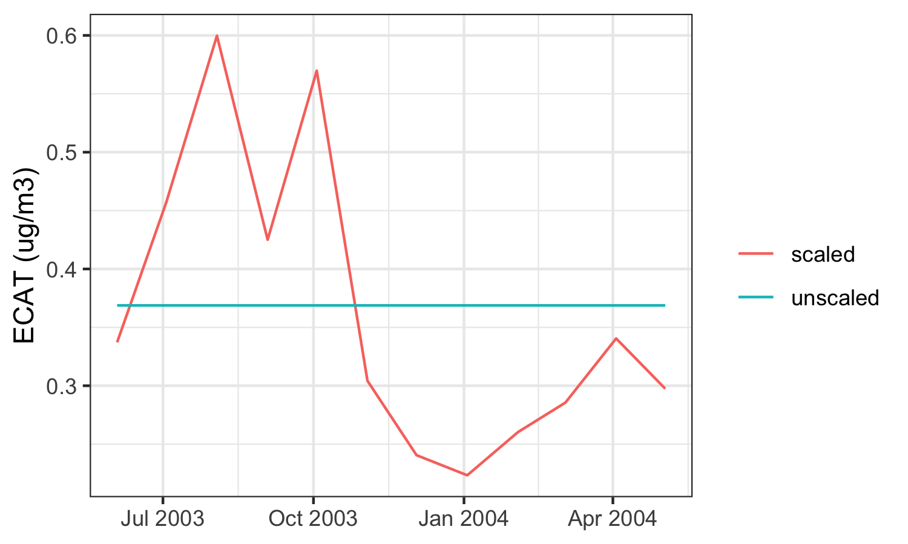

# ecat

The goal of the ecat package is to easily and reproducibly assess exposure to elemental carbon attributable to traffic (ECAT) at specific locations in and around Cincinnati, Ohio. The package calculates predictions of ECAT exposure from a land use regression model developed by Dr. Patrick Ryan based on ambient air sampling in Cincinnati, OH between 2001 and 2005. The model predictors include elevation, truck traffic within 400 meters, and length of bus routes within 100 meters.

Additionally, these ECAT exposures can be adjusted to account for the temporal variation associated with changing ECAT levels in the area over time. Scaling factors are constructed using measurements of elemental carbon (EC) recorded by the EPA in the Cincinnati area. These scaling factors are the average EC measured over a time period of interest (e.g., gestation, the month leading up to date of  hospitilization, etc) divided by the average EC recorded over the ECAT ambient air sampling period (2001 to 2005). Scaling factors are then applied to ECAT estimates from the land use model.

The figure below demonstrates the increased variability when an estimate of ECAT at one location is used as an annual average versus when that annual average is scaled to monthly averages.



## Reference

Ryan, P.H., G.K. LeMasters, P. Biswas, L. Levin, S. Hu, M. Lindsey, D.I. Bernstein, J. Lockey, M. Villareal, G.K. Khurana Hershey, and S.A. Grinshpun. 2007. "A Comparison of Proximity and Land Use Regression Traffic Exposure Models and Wheezing in Infants." Environmental Health Perspectives 115(2): 278-284. [https://doi.org/10.1289/ehp.9480](https://doi.org/10.1289/ehp.9480)

## Installation

ecat is hosted on GitHub; install with:

```
remotes::install_github('erikarasnick/ecat')
```

## Examples

See our [vignette](https://geomarker-io.github.io/ecat/articles/ecat_examples.html) for example usage.

