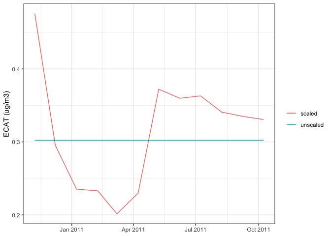

<!-- README.md is generated from README.Rmd. Please edit that file -->

# ecat

The goal of the ecat package is to easily and reproducibly assess
exposure to elemental carbon attributable to traffic (ECAT) at specific
locations in and around Cincinnati, Ohio. The package calculates
predictions of ECAT exposure from a land use regression model developed
by Dr. Patrick Ryan based on ambient air sampling in Cincinnati, OH
between 2001 and 2005. The model predictors include elevation, truck
traffic within 400 meters, and length of bus routes within 100 meters.

map?

Additionally, these ECAT exposures can be adjusted to account for the
temporal variation associated with changing ECAT levels in the area over
time. Scaling factors are constructed using measurements of elemental
carbon (EC) recorded by the EPA in the Cincinnati area. These scaling
factors are the average EC measured over a time period of interest
(e.g., gestation, the month leading up to date of hospitilization, etc)
divided by the average EC recorded over the ECAT ambient air sampling
period (2001 to 2005). Scaling factors are then applied to ECAT
estimates from the land use model.

The figure below demonstrates the increased variability when an estimate
of ECAT at one location is used as an annual average versus when that
annual average is scaled to monthly averages.



## Reference

reference some paper of Pat’s about the model… ?

reference the paper discussing the temporal adjustment method… ?

## Installation

ecat is hosted on GitHub; install with:

``` r
remotes::install_github('erikarasnick/ecat')
```

## Example Usage

``` r
library(ecat)
library(tidyverse)
```

### Example 1: Using `calculate_ecat()` and `calculate_scaling_factors()` and manually applying scaling factors to ECAT estimates.

``` r
d <- tibble::tribble(
  ~id,         ~lon,        ~lat,
    809089L, -84.69127387, 39.24710734,
    813233L, -84.47798287, 39.12005904,
    814881L, -84.47123583,  39.2631309,
    799697L, -84.41741798, 39.18541228,
    799698L, -84.41395064, 39.18322447
  )

visit_dates <- c("2010-01-08", "2012-06-08", "2010-01-09", "2015-04-09", "2010-01-10")
visit_dates <- as.Date(visit_dates)

d %>% 
  mutate(ecat = calculate_ecat(. , return.LU.vars = FALSE), 
         date = visit_dates,
         scaling_factors = calculate_scaling_factors(date, days_prior = 30), 
         scaled_ecat = ecat * scaling_factors)
#> # A tibble: 5 x 7
#>       id   lon   lat  ecat date       scaling_factors scaled_ecat
#>    <int> <dbl> <dbl> <dbl> <date>               <dbl>       <dbl>
#> 1 809089 -84.7  39.2 0.302 2010-01-08           0.668       0.202
#> 2 813233 -84.5  39.1 0.740 2012-06-08           1.18        0.876
#> 3 814881 -84.5  39.3 0.479 2010-01-09           0.708       0.339
#> 4 799697 -84.4  39.2 0.355 2015-04-09           0.728       0.259
#> 5 799698 -84.4  39.2 0.339 2010-01-10           0.708       0.240
```

### Example 2: Using the `calculate_scaled_ecat()` wrapper function to automatically apply scaling factors to ECAT estimates.

``` r
d <- tibble::tribble(
  ~id,         ~lon,        ~lat,        ~date,
    809089L, -84.69127387, 39.24710734, as.Date("2010-01-08"),
    809089L, -84.69127387, 39.24710734, as.Date("2012-06-08"),
    809089L, -84.69127387, 39.24710734, as.Date("2015-04-09"),
    799697L, -84.41741798, 39.18541228, as.Date("2010-01-10"),
    799697L, -84.41741798, 39.18541228, as.Date("2012-12-03")
  )

d %>% 
  mutate(scaled_ecat = calculate_scaled_ecat(., days_prior = 30))
#> # A tibble: 5 x 5
#>       id   lon   lat date       scaled_ecat
#>    <int> <dbl> <dbl> <date>           <dbl>
#> 1 809089 -84.7  39.2 2010-01-08       0.202
#> 2 809089 -84.7  39.2 2012-06-08       0.358
#> 3 809089 -84.7  39.2 2015-04-09       0.220
#> 4 799697 -84.4  39.2 2010-01-10       0.251
#> 5 799697 -84.4  39.2 2012-12-03       0.530
```
